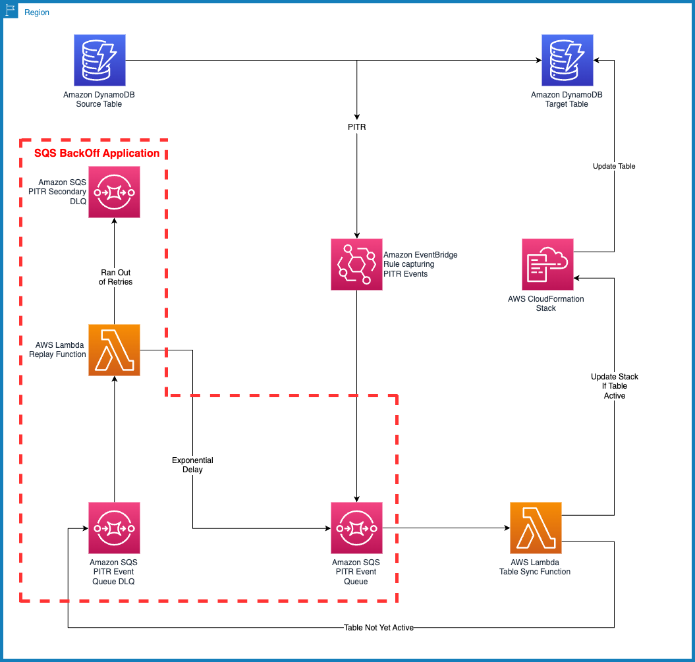

# dynamodb-pitr-table-sync

This serverless application deploys an AWS lambda function that reacts on a `PointInTimeRecovery` Amazon DynamoDB event and clones the settings on the target Amazon DynamoDB table such that source and target table have the same settings.

Settings this application will clone:
1. Tags
2. Kinesis Stream settings
3. DynamoDB stream settings along with triggers
4. PITR settings
5. Auto-scaling policies for both Table and Index
6. Time to live (TTL)

Settings this application will NOT clone:
1. CloudWatch custom metric and alarms (if any).
2. IAM policies

## Architecture Diagram


## Deploy the application

The Serverless Application Model Command Line Interface (SAM CLI) is an extension of the AWS CLI that adds functionality for building and testing Lambda applications. It uses Docker to run your functions in an Amazon Linux environment that matches Lambda. It can also emulate your application's build environment and API.

To use the SAM CLI, you need the following tools.

* SAM CLI - [Install the SAM CLI](https://docs.aws.amazon.com/serverless-application-model/latest/developerguide/serverless-sam-cli-install.html)
* [Python 3 installed](https://www.python.org/downloads/)
* Docker - [Install Docker community edition](https://hub.docker.com/search/?type=edition&offering=community)

To build and deploy your application for the first time, run the following in your shell:

```bash
git clone git@github.com:aws-samples/amazon-dynamodb-pitr-table-sync.git
cd amazon-dynamodb-pitr-table-sync
sam build
sam deploy --guided
```
Commands will do the following:
1. `cd` into the project directory
2. Clone the git repository that implements the `SQS Backoff` functionality and will be used as a nested resource in this project's SAM template.
3. This command will build the source of your application.
4. This command will package and deploy your application to AWS, with a series of prompts:

   * **Stack Name**: The name of the stack to deploy to CloudFormation. This should be unique to your account and region, and a good starting point would be something matching your project name.
   * **AWS Region**: The AWS region you want to deploy your app to.
   * **Parameters for the SAM template**: These are a set of multiple choice decisions that will affect which settings are copied to the new (restored) table.
     * **LambdaFunctionLogLevel**: Logging level for the lambda function. Allowed values: `INFO`, `WARN`, `DEBUG`, `ERROR`
     * **EnableTagSettings**: Copy tags from the source table to the target table. Allowed values: `TRUE`, `FALSE`
     * **EnableKinesisSettings**: Copy Amazon Kinesis settings from the source table to the target table. Allowed values: `TRUE`, `FALSE`
     * **EnableDynamoDBStreamSettings**: Copy Amazon DynamoDB stream settings from the source table to the target table. Allowed values: `TRUE`, `FALSE`
     * **EnableDynamoDBLambdaTrigger**: Copy the AWS Lambda trigger from the source table to the target table. Allowed values: `TRUE`, `FALSE`
     * **EnableTTLSettings**: Copy the TTL(Time-To-Live) settings from the source table to the target table. Allowed values: `TRUE`, `FALSE`
     * **EnablePITRSettings**: Copy Point-In-Time-Restore (PITR) settings from the source table to the target table. Allowed values: `TRUE`, `FALSE`
     * **EnableAutoScalingSettings**: Copy the Application Auto Scaling settings from the source table to the target table. Allowed values: `TRUE`, `FALSE`
   * **Confirm changes before deploy**: If set to yes, any change sets will be shown to you before execution for manual review. If set to no, the AWS SAM CLI will automatically deploy application changes.
   * **Allow SAM CLI IAM role creation**: Many AWS SAM templates, including this example, create AWS IAM roles required for the AWS Lambda function(s) included to access AWS services. By default, these are scoped down to minimum required permissions. To deploy an AWS CloudFormation stack which creates or modifies IAM roles, the `CAPABILITY_IAM` value for `capabilities` must be provided. If permission isn't provided through this prompt, to deploy this example you must explicitly pass `--capabilities CAPABILITY_IAM` to the `sam deploy` command.
   * **Disable Rollback**: If set to yes, rollback will be disabled for the AWS CloudFormation stack that the AWS SAM template will create.
   * **Save arguments to samconfig.toml**: If set to yes, your choices will be saved to a configuration file inside the project, so that in the future you can just re-run `sam deploy` without parameters to deploy changes to your application.

## Build and test locally

Build your application with the `sam build` command.

```bash
dynamodb-pitr-table-sync$ sam build
```

The SAM CLI installs dependencies defined in `src/requirements.txt`, creates a deployment package, and saves it in the `.aws-sam/build` folder.

Test a single function by invoking it directly with a test event. An event is a JSON document that represents the input that the function receives from the event source. Test events are included in the `events` folder in this project.

Run functions locally and invoke them with the `sam local invoke` command.

```bash
dynamodb-pitr-table-sync$ sam local invoke DynamoDBTableConfigSync --event events/event.json
```

Don't forget to update the event.json detail with the fields you want to set from your schema.aws.events.scheduledjson.ScheduledEvent object


```yaml
      Events:
        HelloWorld:
          Type: CloudWatchEvent # More info about CloudWatchEvent Event Source: https://github.com/awslabs/serverless-application-model/blob/master/versions/2016-10-31.md#cloudwatchevent
          Properties:
            Pattern:
              source:
                - aws.events
              detail-type:
                - Scheduled Event
```

## Fetch, tail, and filter Lambda function logs

To simplify troubleshooting, SAM CLI has a command called `sam logs`. `sam logs` lets you fetch logs generated by your deployed Lambda function from the command line. In addition to printing the logs on the terminal, this command has several nifty features to help you quickly find the bug.

`NOTE`: This command works for all AWS Lambda functions; not just the ones you deploy using SAM.

```bash
dynamodb-pitr-table-sync$ sam logs -n TableSyncFunction --stack-name dynamodb-pitr-table-sync --tail
```

You can find more information and examples about filtering Lambda function logs in the [SAM CLI Documentation](https://docs.aws.amazon.com/serverless-application-model/latest/developerguide/serverless-sam-cli-logging.html).

## Unit tests

Tests are defined in the `tests` folder in this project. Use PIP to install the [pytest](https://docs.pytest.org/en/latest/) and run unit tests.

```bash
dynamodb-pitr-table-sync$ pip install pytest pytest-mock --user
dynamodb-pitr-table-sync$ python -m pytest tests/ -v
```

## Cleanup

To delete the sample application that you created, use the SAM CLI. Assuming you used your project name for the stack name, you can run the following:

```bash
sam delete --stack-name dynamodb-pitr-table-sync
```


## Resources

This SAM application uses a nested application to replay events in the SQS queue until the target Amazon DynamoDB table is in `ACTIVE` state. See the [AMAZON-SQS-DLQ-REPLAY-BACKOFF](https://github.com/aws-samples/amazon-sqs-dlq-replay-backoff) for details on how SQS backoff is implemented.

See the [AWS SAM developer guide](https://docs.aws.amazon.com/serverless-application-model/latest/developerguide/what-is-sam.html) for an introduction to SAM specification, the SAM CLI, and serverless application concepts.

Next, you can use AWS Serverless Application Repository to deploy ready to use Apps that go beyond hello world samples and learn how authors developed their applications: [AWS Serverless Application Repository main page](https://aws.amazon.com/serverless/serverlessrepo/)

## Security

Please update [Pydantic](https://pypi.org/project/pydantic/), [boto3](https://pypi.org/project/boto3/), [aws-lambda-powertools](https://pypi.org/project/aws-lambda-powertools/) as and when updates are available.

Alternatively, you can use [pip-audit](https://pypi.org/project/pip-audit/) to detect any vulnerabilities.

See [CONTRIBUTING](CONTRIBUTING.md#security-issue-notifications) for more information.

### Permissions spanning across multiple resources

1. The Lambda function execution role has permissions where resources are set to `*` within a specific resource type.
2. Once a table is restored, Amazon EventBridge sends the name to the lambda function.
3. The table name the AWS Lambda function receives is updated. This way one functions works for all the tables in the account. Hence, permissions spanning across resources.
4. The only AWS IAM policy statement with resource `*` is `AllowEventSourceMappingsActions` statement. The actions listed in these statements do not support resource restrictions on the action. Please find more information [here](https://docs.aws.amazon.com/service-authorization/latest/reference/list_awslambda.html#awslambda-actions-as-permissions).


## License

This library is licensed under the MIT-0 License. See the LICENSE file.

